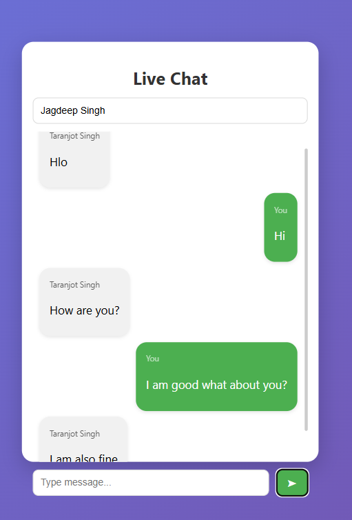
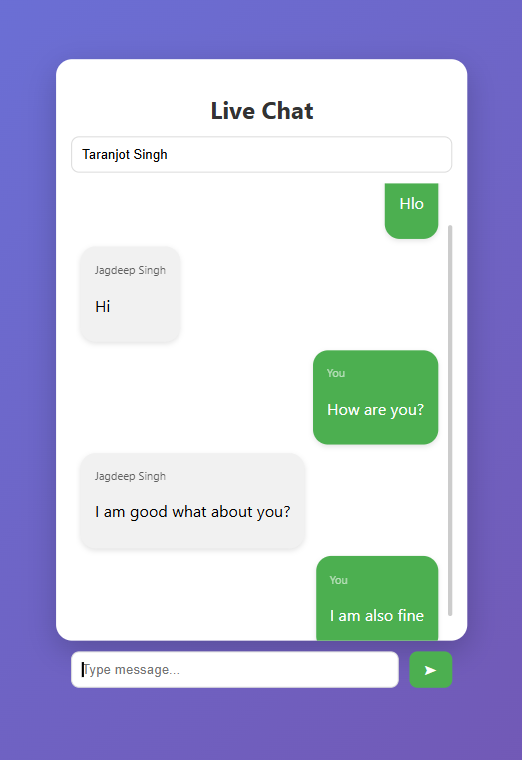

# WebSocket Chat Application (Experiment 10)

##  Overview

This project demonstrates a **real-time chat application** using **WebSocket technology**.
It enables instant communication between users without refreshing the page.

The project is divided into:

* **Backend** – Built with Spring Boot (WebSocket-based server)
* **Frontend** – Built with React (interactive UI)
* **Screenshots** – Output images of the application

---

## Tech Stack

### Backend:

* Java
* Spring Boot
* WebSocket (STOMP protocol)

### Frontend:

* React.js
* JavaScript
* HTML & CSS

---

##  Project Structure

```
EXP10/
│── Demo_WebSocket/     # Spring Boot Backend
│── frontend/           # React Frontend
│── screenshots/        # Output Screenshots
│── README.md
```

---

## ⚙️ How to Run the Project

### 1️⃣ Run Backend

* Open `Demo_WebSocket` in Eclipse 
* Run the Spring Boot application
* Server starts on: `http://localhost:8080`

---

###  Run Frontend

```bash
cd frontend
npm install
npm start
```

* App runs on: `http://localhost:3000`

---

##  Features

*  Real-time messaging using WebSockets
*  Instant updates without page reload
*  Interactive and responsive UI
*  Client-server communication using STOMP protocol

---

## 📸 Output Screenshots

###  Chat Interface (1.1)



### Message Exchange (1.2)



> Make sure your screenshot files are named exactly:
> `1.1.png` and `1.2.png` inside the `screenshots` folder

---

## Learning Outcomes

* Understanding WebSocket communication
* Implementing real-time applications
* Integration of React frontend with Spring Boot backend
* Handling live data exchange


---
